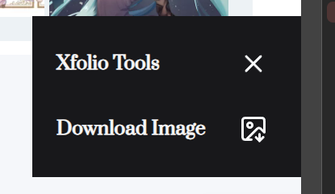

# Xfolio tampermonkey plugin

Save Xfolio images quickly and easily

## Install

Required any tampermonkey manager.

Then [Click to Install](https://github.com/keiko233/xfolio-plugin/releases/download/pre-release/xfolio-plugin.user.js)

## How to use

1. Open https://xfolio.jp/
2. Click hammer button in the bottom right corner of your screen
3. Enjoy.

## Preview

